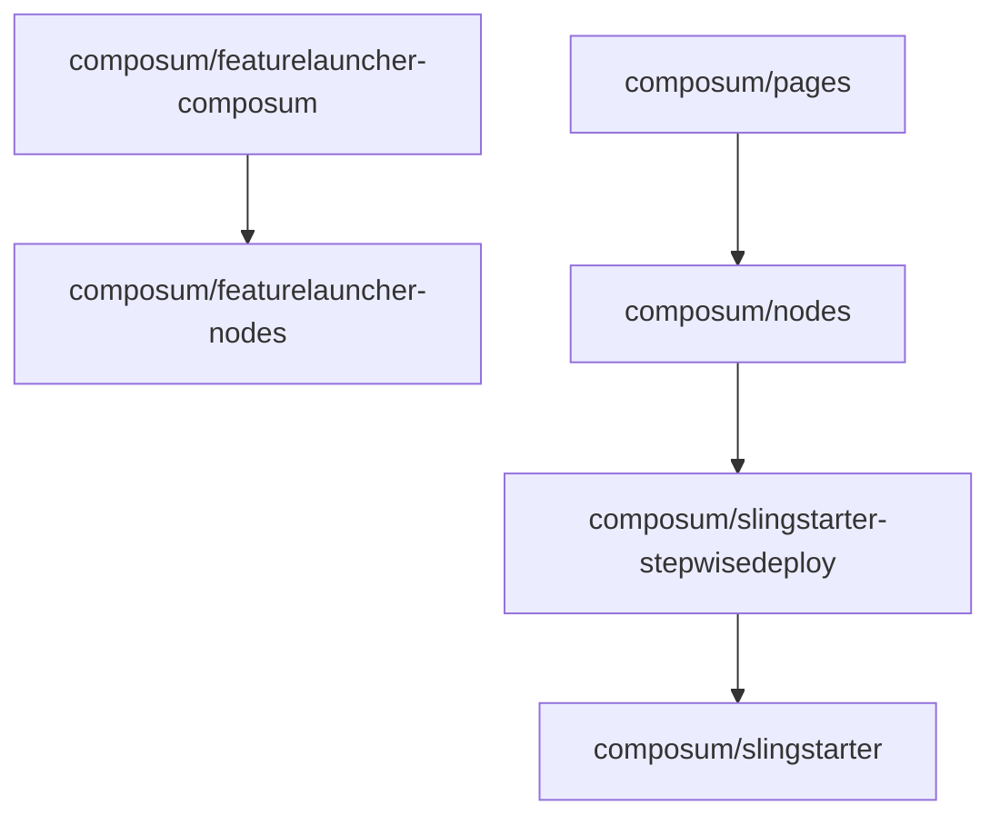
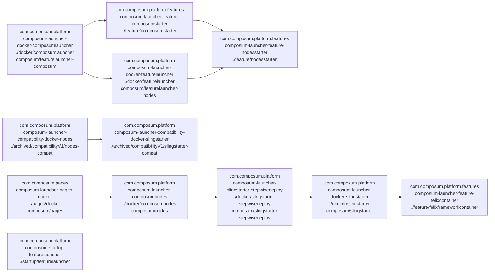

# Overview over the modules, their classification and dependencies

## Docker image to folder map
 
- composum/slingstarter - Module: docker/slingstarter
- composum/slingstarter-stepwisedeploy - Module: docker/slingstarter-stepwisedeploy
- composum/featurelauncher-nodes - Module: docker/featurelauncher
- composum/nodes - Module: docker/composumnodes, Dependencies: docker/slingstarter-stepwisedeploy
- composum/featurelauncher-composum - Module: docker/composumlauncher, Dependencies: docker/featurelauncher, composum-launcher-feature-composumstarter, composum-launcher-feature-integrationtest
- composum/pages - Module: pages/docker, Dependencies: composum-launcher-composumnodes, composum-launcher-feature-integrationtest

## Docker image dependencies

## Dependency diagram

The following maps out most of the dependencies of the folders / docker images. The node labels contain in the first 
line the groupid, second the artifactid, fourth folder and fourth line the docker image name on dockerhub.

## Abbreviations for group ids etc.
- cpm: = com.composum.platform:              (default group) 
- cpmf: = com.composum.platform.features:    (always and only in directory features/)
- :: is :: or whatever version is current
- :CL- is :composum-launcher-

## Modules

- docker/slingstarter cpm:CL-docker-slingstarter::docker
- docker cpm:CL-docker::pom
- docker/slingstarter-stepwisedeploy cpm:CL-slingstarter-stepwisedeploy:1.5.
  0-SNAPSHOT:docker-build
- docker/composumlauncher cpm:CL-docker-composumlauncher::docker
- docker/featurelauncher cpm:CL-docker-featurelauncher::docker
- docker/composumnodes cpm:CL-composumnodes::docker
- feature/sling-starter-copy cpmf:sling.starter.copy:1.3.1-SNAPSHOT:
- feature/nodesstarter cpmf:CL-feature-nodesstarter::
- feature cpmf:CL-feature::pom
- feature/composumstarter cpmf:CL-feature-composumstarter::
- feature/felixframeworkcontainer cpmf:CL-feature-felixcontainer::pom
- feature/integrationtest cpmf:CL-feature-integrationtest::

## Deprecated modules

- pages/starter com.composum.pages:CL-pages-starter:1.3.1-SNAPSHOT:slingstart
  old Sling Starter directly integrating packages via provisioning, < Sling Starter 11
- pages/docker com.composum.pages:CL-pages-docker::docker
  uses pages/starter

## Independent experiments, no docker image or deliverables
- startup/featurelauncher cpm:composum-startup-featurelauncher::pom

## Intermediate poms
(No interesting content but for submodules)
. cpm:composum-launcher::pom
- pages cpm:CL-pages::pom

## Obsolete (don't look at it, don't touch, not necessarily compileable)

- archived/compatibilityV1/slingstarter-compat cpm:CL-compatibility-docker-slingstarter::docker
- archived/compatibilityV1 cpm:CL-compatibility::pom
- archived/compatibilityV1/nodes-compat cpm:CL-compatibility-docker-nodes:1.3.1-SNAPSHOT:docker
