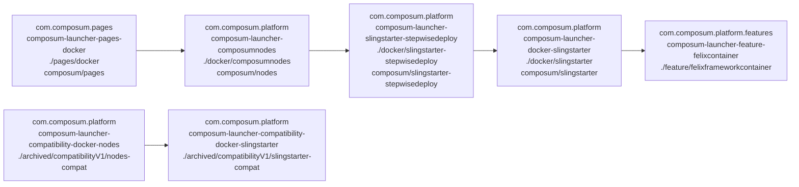

# Obsolete parts

There are some parts of this project which still exist in the source code at [archived](archived/README.md) but are 
no longer maintained. Especially there are some Sling Starter 11 based starters / docker images, which we won't 
extend or maintain unless you ask nicely. For now they are moved to archived/starter11

Here's the documentation of those:

## Deprecated (unmaintained) docker images

- [**slingstarter**](docker/slingstarter/): (obsolete) docker image
  [composum/slingstarter](https://cloud.docker.com/u/composum/repository/docker/composum/slingstarter)
  starts a [Sling Starter](https://github.com/apache/sling-org-apache-sling-starter) on JDK 11 with enabled debugging
  and JMX and some provisions to automatically install more packages when a derived docker
  image is started.

- [**slingstarter-stepwisedeploy**](docker/slingstarter-stepwisedeploy/): (obsolete) docker image
  [composum/slingstarter-stepwisedeploy](https://cloud.docker.com/u/composum/repository/docker/composum/slingstarter-stepwisedeploy)
  based on slingstarter that sets up some basic scripts for the stepwise deployment of packages within sling starter
  from a docker image to avoid problems with dependencies between them.

- [**pages/docker**](pages/docker/): (obsolete) docker image
  [composum/pages](https://cloud.docker.com/u/composum/repository/docker/composum/pages) based on slingstarter, it
  deploys both the newest version of
  the [Composum Nodes](https://github.com/ist-dresden/composum), [Composum Platform](https://github.com/ist-dresden/composum-platform)
  and [Composum Pages](https://github.com/ist-dresden/composum-pages). (TODO: make this based on
  slingstarter-stepwisedeploy.)

- [archived/compatibilityV1/*](archived/compatibilityV1/) like slingstarter, but with an earlier Sling Launchpad version
  that was supported the Composum Nodes (as of 4/2019: version 9 on JDK 8); not supported anymore.

Since there are various modules involved, we normally use the pages version as version number for all docker images, as
kind of the leading module.

# Start Composum Pages using docker (obsolete Sling 11 starter)

## Pull from dockerhub

Run as a temporary installation (after stopping the container all data is deleted):

    docker pull composum/pages:{version}
    docker run --rm -p 8080:8080 composum/pages:{version}

where `{version}` has to be replaced by the current version of this project, e.g. `1.2.1-SNAPSHOT` .

Compare the [docker run](https://docs.docker.com/engine/reference/run/) documentation for other options.
Composum Pages is accessible at http://localhost:8080/bin/pages.html one or two minutes after starting.

## Obsolete (unmaintained) starters

[**pages/starter**](pages/starter): (obsolete) contains a [Sling Starter](https://github.
com/apache/sling-org-apache-sling-starter)
version 11 extended with the newest version of
the [Composum Nodes](https://github.com/ist-dresden/composum), [Composum Platform](https://github.com/ist-dresden/composum-platform)
and [Composum Pages](https://github.com/ist-dresden/composum-pages). Since it is based on Starter 11, this is obsolete.

To get these, you can build them yourself, or grab a snapshot from
our [snapshot repository](https://build.ist-software.com/nexus/#browse/browse:maven-snapshots:com%2Fcomposum%2Fpages%2Fcomposum-launcher-pages-starter).

Composum Pages is accessible at http://localhost:8080/bin/pages.html after starting

    java -jar composum-pages-starter-1.0.0-SNAPSHOT.jar

(You need to wait one or two minutes for Sling to fully start up.)
