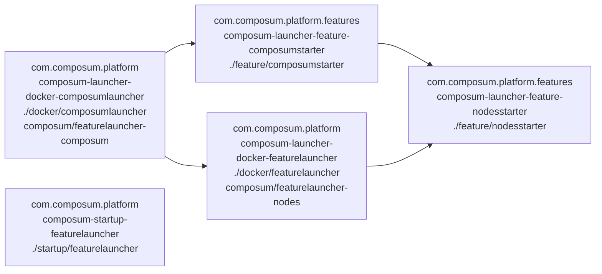

# Contents

This repository contains the sources for building some starters that allow you to try out or use the public parts
of the [Composum](http://composum.com/) suite - both as Docker images and as Sling Starter JAR with preinstalled
Composum Nodes, Platform, Pages, Assets and ChatGPT-Intergration.

# Start Composum Pages as JAR based on Sling Starter

[**feature/nodesstarter**](feature/nodesstarter):
A [Sling Starter](https://github.com/apache/sling-org-apache-sling-starter)
12 with composum nodes installed in the newest version, and some provisions to install packages (
see [feature/README.md](feature/README.md)), and run it offline.
[on mvnrepository.com](https://mvnrepository.com/artifact/com.composum.platform.features/composum-launcher-feature-nodesstarter) / 
[on search.maven.org](https://search.maven.org/search?q=a:composum-launcher-feature-nodesstarter)
[**feature/composumstarter**](feature/composumstarter): Extends the feature/nodesstarter with all public Composum
modules. (There are some enterprise modules, which aren't contained.)
[On mvnrepository.com](https://mvnrepository.com/artifact/com.composum.platform.features/composum-launcher-feature-composumstarterm) / 
[On search.maven.org](https://search.maven.org/search?q=a:composum-launcher-feature-composumstarter)
[Download it](https://search.maven.org/search?q=a:composum-launcher-feature-composumstarter) - e.g. the 
oak_tar-launcher.jar , and start it with java -jar. 

# Available Docker images

This module creates a couple of docker images with which it is easy to run the public parts of
the [Composum](http://composum.com/) suite. All images are available for amd64 (Intel) and arm64 (Mac M1/M2) 
architectures.

- [**featurelauncher**](docker/featurelauncher/): docker image
  [composum/featurelauncher-nodes](https://hub.docker.com/r/composum/featurelauncher-nodes)
  using the feature launcher, deploying a snapshot of
  Sling Starter 12 and preparing for further deployments both as feature archives and as packages from the filesystem.

- [**composumlauncher**](docker/composumlauncher/): docker image
  [composum/featurelauncher-composum](https://hub.docker.com/r/composum/featurelauncher-composum)
  with a sling feature launcher that launches a FAR from a Sling Starter 12 and includes all public Composum modules
  as features. Based on the featurelauncher docker image ( composum/featurelauncher-nodes ).

# Start the Composum Suite (incl. Pages and additional modules) using docker

## Pull from dockerhub

Run as a temporary installation (after stopping the container all data is deleted):

    docker pull composum/featurelauncher-composum:latest
    docker run --rm -p 8080:8080 composum/featurelauncher-composum:latest

Alternatively, you can also use tag develop instead of latest to use a later snapshot.

Compare the [docker run](https://docs.docker.com/engine/reference/run/) documentation for other options.
Composum Pages is accessible at http://localhost:8080/bin/pages.html one or two minutes after starting.

## Build the docker images and start locally

Do a `mvn clean install` on everything and start in the corresponding directory
using [docker-compose](https://docs.docker.com/compose/):

    docker-compose up --force-recreate -V --abort-on-container-exit

Stop it and destroy created containers with:

    docker-compose down --rmi local -v --remove-orphans

## Build the docker images and start locally

Do a `mvn clean install` on everything and start in the corresponding directory
using [docker-compose](https://docs.docker.com/compose/):

    docker-compose up --force-recreate -V --abort-on-container-exit

Stop it and destroy created containers with:

    docker-compose down --rmi local -v --remove-orphans

## Dependency diagram

The following maps out most of the dependencies of the folders / docker images. The node labels contain in the first 
line the groupid, second the artifactid, fourth folder and fourth line the docker image name on dockerhub.

# Other directories

- [**startup**](startup/): some experiments how to start up Sling with composum using the various starters. 
