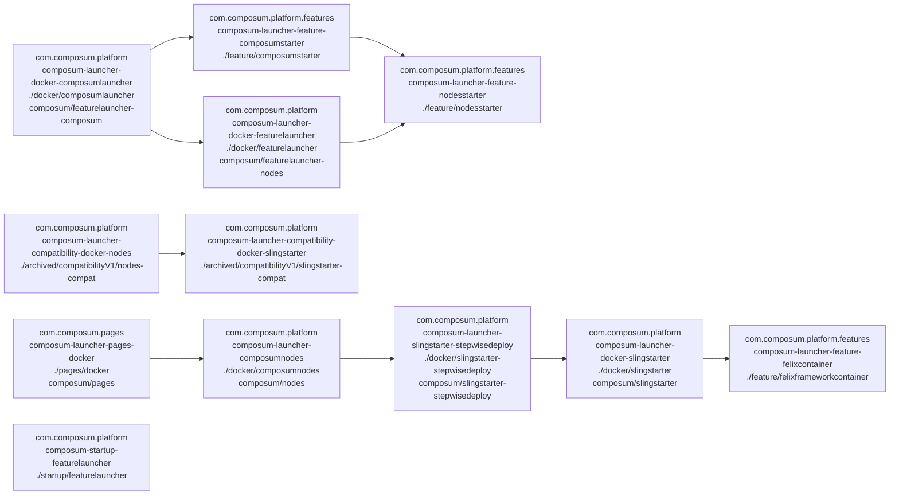

# Contents

This repository contains the sources for building some starters that allow you to try out or use the public parts
of the [Composum](http://composum.com/) suite - both some Docker images and a Sling Starter JAR with preinstalled
Composum Nodes, Platform and Pages.

# Available Docker images

This module creates a couple of docker images with which it is easy to run the public parts of
the [Composum](http://composum.com/) suite.

- [**featurelauncher**](docker/featurelauncher/): docker image
  [composum/featurelauncher-nodes](https://hub.docker.com/r/composum/featurelauncher-nodes)
  using the feature launcher, deploying a snapshot of
  Sling Starter 12 and preparing for further deployments both as feature archives and as packages from the filesystem.

- [**composumlauncher**](docker/composumlauncher/): docker image
  [composum/featurelauncher-composum](https://hub.docker.com/r/composum/featurelauncher-composum)
  with a sling feature launcher that launches a FAR from a Sling Starter 12 and includes all public Composum modules
  as features. Based on the featurelauncher docker image ( composum/featurelauncher-nodes ).

## Deprecated (unmaintained) docker images

- [**slingstarter**](docker/slingstarter/): (obsolete) docker image
  [composum/slingstarter](https://cloud.docker.com/u/composum/repository/docker/composum/slingstarter)
  starts a [Sling Starter](https://github.com/apache/sling-org-apache-sling-starter) on JDK 11 with enabled debugging
  and JMX and some provisions to automatically install more packages when a derived docker
  image is started.

- [**slingstarter-stepwisedeploy**](docker/slingstarter-stepwisedeploy/): (obsolete) docker image
  [composum/slingstarter-stepwisedeploy](https://cloud.docker.com/u/composum/repository/docker/composum/slingstarter-stepwisedeploy)
  based on slingstarter that sets up some basic scripts for the stepwise deployment of packages within sling starter
  from a docker image to avoid problems with dependencies between them.

- [**pages/docker**](pages/docker/): (obsolete) docker image
  [composum/pages](https://cloud.docker.com/u/composum/repository/docker/composum/pages) based on slingstarter, it
  deploys both the newest version of
  the [Composum Nodes](https://github.com/ist-dresden/composum), [Composum Platform](https://github.com/ist-dresden/composum-platform)
  and [Composum Pages](https://github.com/ist-dresden/composum-pages). (TODO: make this based on
  slingstarter-stepwisedeploy.)

- [archived/compatibilityV1/*](archived/compatibilityV1/) like slingstarter, but with an earlier Sling Launchpad version
  that was supported the Composum Nodes (as of 4/2019: version 9 on JDK 8); not supported anymore.

Since there are various modules involved, we normally use the pages version as version number for all docker images, as
kind of the leading module.

## Dependency diagram

The following maps out most of the dependencies of the folders / docker images. The node labels contain in the first 
line the groupid, second the artifactid, fourth folder and fourth line the docker image name on dockerhub.

# Start the Composum Suite (incl. Pages and additional modules) using docker

## Pull from dockerhub

Run as a temporary installation (after stopping the container all data is deleted):

    docker pull composum/featurelauncher-composum:latest
    docker run --rm -p 8080:8080 composum/featurelauncher-composum:latest

Alternatively, you can also use tag develop instead of latest to use a later snapshot.

Compare the [docker run](https://docs.docker.com/engine/reference/run/) documentation for other options.
Composum Pages is accessible at http://localhost:8080/bin/pages.html one or two minutes after starting.

## Build the docker images and start locally

Do a `mvn clean install` on everything and start in the corresponding directory
using [docker-compose](https://docs.docker.com/compose/):

    docker-compose up --force-recreate -V --abort-on-container-exit

Stop it and destroy created containers with:

    docker-compose down --rmi local -v --remove-orphans

# Start Composum Pages using docker (obsolete Sling 11 starter)

## Pull from dockerhub

Run as a temporary installation (after stopping the container all data is deleted):

    docker pull composum/pages:{version}
    docker run --rm -p 8080:8080 composum/pages:{version}

where `{version}` has to be replaced by the current version of this project, e.g. `1.2.1-SNAPSHOT` .

Compare the [docker run](https://docs.docker.com/engine/reference/run/) documentation for other options.
Composum Pages is accessible at http://localhost:8080/bin/pages.html one or two minutes after starting.

## Build the docker images and start locally

Do a `mvn clean install` on everything and start in the corresponding directory
using [docker-compose](https://docs.docker.com/compose/):

    docker-compose up --force-recreate -V --abort-on-container-exit

Stop it and destroy created containers with:

    docker-compose down --rmi local -v --remove-orphans

# Start Composum Pages using Sling Starter

[**feature/nodesstarter**](feature/nodesstarter):
A [Sling Starter](https://github.com/apache/sling-org-apache-sling-starter)
12 with composum nodes installed in the newest version, and some provisions to install packages (
see [feature/README.md](feature/README.md)), and run it offline.
[**feature/composumstarter**](feature/composumstarter): Extends the feature/nodesstarter with all public Composum
modules. (There are some enterprise modules, which aren't contained.)

## Obsolete (unmaintained) starters

[**pages/starter**](pages/starter): (obsolete) contains a [Sling Starter](https://github.
com/apache/sling-org-apache-sling-starter)
version 11 extended with the newest version of
the [Composum Nodes](https://github.com/ist-dresden/composum), [Composum Platform](https://github.com/ist-dresden/composum-platform)
and [Composum Pages](https://github.com/ist-dresden/composum-pages). Since it is based on Starter 11, this is obsolete.

To get these, you can build them yourself, or grab a snapshot from
our [snapshot repository](https://build.ist-software.com/nexus/#browse/browse:maven-snapshots:com%2Fcomposum%2Fpages%2Fcomposum-launcher-pages-starter).

Composum Pages is accessible at http://localhost:8080/bin/pages.html after starting

    java -jar composum-pages-starter-1.0.0-SNAPSHOT.jar

(You need to wait one or two minutes for Sling to fully start up.)

# Other directories

- [**startup**](startup/): some experiments how to start up Sling with composum using the various starters

# Building this module

Because of docker pull rate limiting
https://docs.docker.com/docker-hub/download-rate-limit/
and because there are some images for compatibility checking that are rarely needed, and many images are Sling Starter
11 based, which is now more or less obsolete, there are some maven profiles you'd have to set if you really want to
build everything:

**compat**: this profile builds the docker images for compatibility checking
**obsolete**: this profile builds the docker images using Sling Starter 11 (which are mentioned above but marked as
obsolete).

So, to build absolutely everything, you'd have to call
mvn clean install -P compat,obsolete

The automatic deployment on Github does nothing for docker since we do not currently have a working
automatic solution for multi architecture docker builds. 
